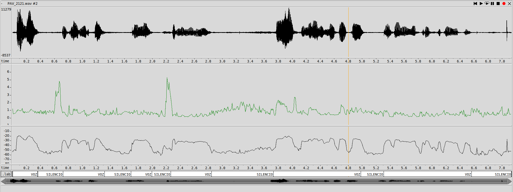
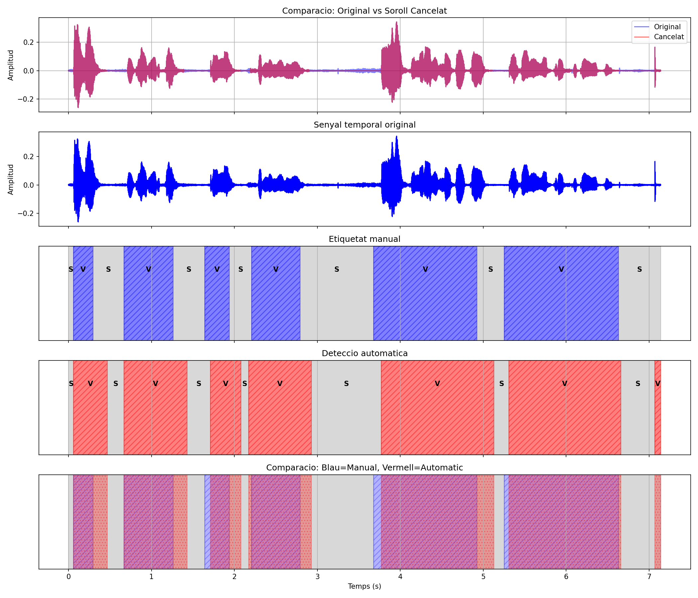
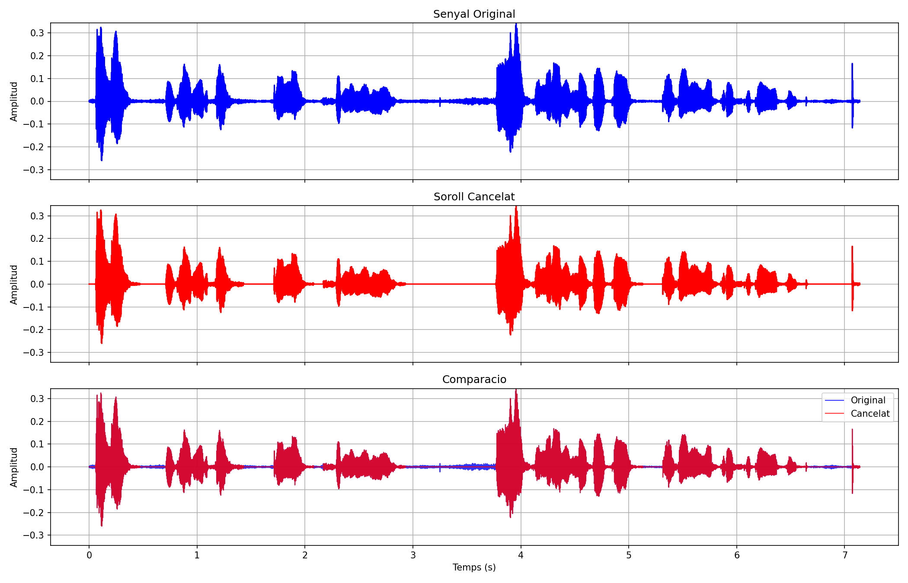
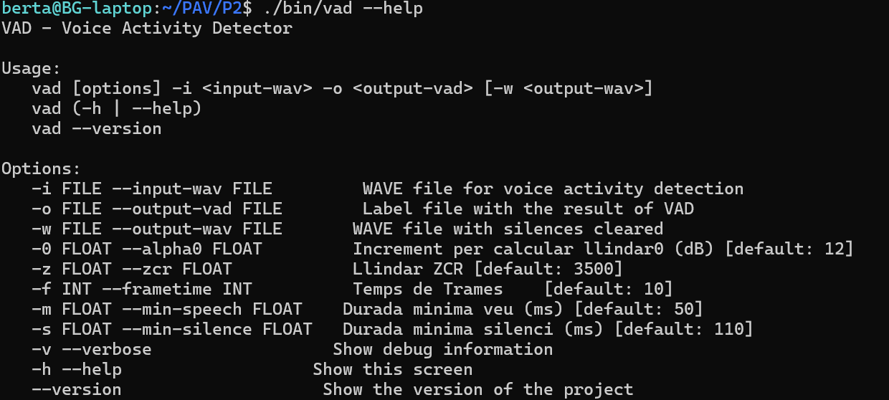

PAV - P2: detección de actividad vocal (VAD)
============================================

Esta práctica se distribuye a través del repositorio GitHub [Práctica 2](https://github.com/albino-pav/P2),
y una parte de su gestión se realizará mediante esta web de trabajo colaborativo.  Al contrario que Git,
GitHub se gestiona completamente desde un entorno gráfico bastante intuitivo. Además, está razonablemente
documentado, tanto internamente, mediante sus [Guías de GitHub](https://guides.github.com/), como
externamente, mediante infinidad de tutoriales, guías y vídeos disponibles gratuitamente en internet.


Inicialización del repositorio de la práctica.
----------------------------------------------

Para cargar los ficheros en su ordenador personal debe seguir los pasos siguientes:

*  Abra una cuenta GitHub para gestionar esta y el resto de prácticas del curso.
*  Cree un repositorio GitHub con el contenido inicial de la práctica (sólo debe hacerlo uno de los
  integrantes del grupo de laboratorio, cuya página GitHub actuará de repositorio central del grupo):
  -  Acceda la página de la [Práctica 2](https://github.com/albino-pav/P2).
  -  En la parte superior derecha encontrará el botón **`Fork`**. Apriételo y, después de unos segundos,
    se creará en su cuenta GitHub un proyecto con el mismo nombre (**P2**). Si ya tuviera uno con ese 
    nombre, se utilizará el nombre **P2-1**, y así sucesivamente.
*  Habilite al resto de miembros del grupo como *colaboradores* del proyecto; de este modo, podrán
  subir sus modificaciones al repositorio central:
  -  En la página principal del repositorio, en la pestaña **:gear:`Settings`**, escoja la opción 
    **Collaborators** y añada a su compañero de prácticas.
  -  Éste recibirá un email solicitándole confirmación. Una vez confirmado, tanto él como el
    propietario podrán gestionar el repositorio, por ejemplo: crear ramas en él o subir las
    modificaciones de su directorio local de trabajo al repositorio GitHub.
*  En la página principal del repositorio, localice el botón **Branch: master** y úselo para crear
  una rama nueva con los primeros apellidos de los integrantes del equipo de prácticas separados por
  guion (**fulano-mengano**).
*  Todos los miembros del grupo deben realizar su copia local en su ordenador personal.
  -  Copie la dirección de su copia del repositorio apretando en el botón **Clone or download**.
    Asegúrese de usar *Clone with HTTPS*.
  -  Abra una sesión de Bash en su ordenador personal y vaya al directorio **PAV**. Desde ahí, ejecute:

    ```.sh
    git clone dirección-del-fork-de-la-práctica
    ```

  -  Vaya al directorio de la práctica `cd P2`.

  -  Cambie a la rama **fulano-mengano** con la orden:

    ```.sh
    git checkout fulano-mengano
    ```

*  A partir de este momento, todos los miembros del grupo de prácticas pueden trabajar en su directorio
  local del modo habitual, usando el repositorio remoto en GitHub como repositorio central para el trabajo colaborativo
  de los distintos miembros del grupo de prácticas o como copia de seguridad.
  -  Puede *confirmar* versiones del proyecto en su directorio local con las órdenes siguientes:

    ```.sh
    git add .
    git commit -m "Mensaje del commit"
    ```

  -  Las versiones confirmadas, y sólo ellas, se almacenan en el repositorio y pueden ser accedidas en cualquier momento.

*  Para interactuar con el contenido remoto en GitHub es necesario que los cambios en el directorio local estén confirmados.

  -  Puede comprobar si el directorio está *limpio* (es decir, si la versión actual está confirmada) usando el comando
    `git status`.

  -  La versión actual del directorio local se sube al repositorio remoto con la orden:

    ```.sh
    git push
    ```

    *  Si el repositorio remoto contiene cambios no presentes en el directorio local, `git` puede negarse
      a subir el nuevo contenido.

      -  En ese caso, lo primero que deberemos hacer es incorporar los cambios presentes en el repositorio
        GitHub con la orden `git pull`.

      -  Es posible que, al hacer el `git pull` aparezcan *conflictos*; es decir, ficheros que se han modificado
        tanto en el directorio local como en el repositorio GitHub y que `git` no sabe cómo combinar.

      -  Los conflictos aparecen marcados con cadenas del estilo `>>>>`, `<<<<` y `====`. Los ficheros correspondientes
        deben ser editados para decidir qué versión preferimos conservar. Un editor avanzado, del estilo de Microsoft
        Visual Studio Code, puede resultar muy útil para localizar los conflictos y resolverlos.

      -  Tras resolver los conflictos, se ha de confirmar los cambios con `git commit` y ya estaremos en condiciones
        de subir la nueva versión a GitHub con el comando `git push`.


  -  Para bajar al directorio local el contenido del repositorio GitHub hay que ejecutar la orden:

    ```.sh
    git pull
    ```
  
    *  Si el repositorio local contiene cambios no presentes en el directorio remoto, `git` puede negarse a bajar
      el contenido de este último.

      -  La resolución de los posibles conflictos se realiza como se explica más arriba para
        la subida del contenido local con el comando `git push`.


*  Al final de la práctica, la rama **fulano-mengano** del repositorio GitHub servirá para remitir la
  práctica para su evaluación utilizando el mecanismo *pull request*.
  -  Vaya a la página principal de la copia del repositorio y asegúrese de estar en la rama
    **fulano-mengano**.
  -  Pulse en el botón **New pull request**, y siga las instrucciones de GitHub.


Entrega de la práctica.
-----------------------

Responda, en este mismo documento (README.md), los ejercicios indicados a continuación. Este documento es
un fichero de texto escrito con un formato denominado _**markdown**_. La principal característica de este
formato es que, manteniendo la legibilidad cuando se visualiza con herramientas en modo texto (`more`,
`less`, editores varios, ...), permite amplias posibilidades de visualización con formato en una amplia
gama de aplicaciones; muy notablemente, **GitHub**, **Doxygen** y **Facebook** (ciertamente, :eyes:).

En GitHub. cuando existe un fichero denominado README.md en el directorio raíz de un repositorio, se
interpreta y muestra al entrar en el repositorio.

Debe redactar las respuestas a los ejercicios usando Markdown. Puede encontrar información acerca de su
sintáxis en la página web [Sintaxis de Markdown](https://daringfireball.net/projects/markdown/syntax).
También puede consultar el documento adjunto [MARKDOWN.md](MARKDOWN.md), en el que se enumeran los
elementos más relevantes para completar la redacción de esta práctica.

Recuerde realizar el *pull request* una vez completada la práctica.

Ejercicios
----------

### Etiquetado manual de los segmentos de voz y silencio

- Grabe una señal de voz en la que haya distintos segmentos de voz y silencio. La señal debe ser de un
  solo canal (monofónica), grabada con una frecuencia de muestreo de 16 kHz y codificada con PCM lineal
  de 16 bits.

  Nombre a la señal como `pav_GGP#.wav`, donde GG es el grupo de clase (por ejemplo, 21 o 41), P es el
  número del puesto de trabajo y # es el número de señal (si sólo se entrega una señal, este número es
  1).

  > NOTA: es habitual que las grabaciones empiecen con un segmento de silencio de potencia extremadamente
  > bajo; mucho más bajo que el nivel de ruido normal durante el resto de la señal. Si esto ocurre, la
  > detección usando como nivel de referencia para el silencio el segmento inicial se ve seriamente
  > dificultada. Puede detectar esta situación visualizando el nivel de potencia estimado por el propio
  > `wavesurfer` y corregirla usando la herramienta de corte (:scissors:).

- Etiquete manualmente los segmentos de voz y silencio del fichero grabado al efecto. Inserte, a
  continuación, una captura de `wavesurfer` en la que se vea con claridad la señal temporal, el contorno de
  potencia y la tasa de cruces por cero, junto con el etiquetado manual de los segmentos.

- A la vista de la gráfica, indique qué valores considera adecuados para las magnitudes siguientes:

  La grafica es la siguiente:

  

  * Incremento del nivel potencia en dB, respecto al nivel correspondiente al silencio inicial, para estar seguros de que un segmento de señal se corresponde con voz.

    La poténcia correspondiente al silencio inicial esta alrededor de unos -60 dB en canvio el segment de voz varia entre (-35,-20)  dB asi que esto supone un incremento claro del nivel de potencia de unos 20 a 25 dB respecto al silencio de fondo.

  * Duración mínima razonable de los segmentos de voz y silencio.

    Respecto a nuestro fichero, el segmento de voz medido dura 0.34 segundos (2.01 - 1.67) y el de silencio dura 0.18 segundos (2.18 - 2.0). A partir de esto, definimos los mínimos teóricos:

      * Voz (mínimo 0.05 - 0.1s): Es el tiempo necesario para asegurar que el sonido es habla real y no un simple ruido corto o golpe.

      * Silencio (mínimo 0.1 - 0.2s): Es el margen necesario para confirmar que hay una pausa real o fin de frase, evitando cortar la grabación durante los silencios súper cortos que hacemos de forma natural al articular palabras.


  * ¿Es capaz de sacar alguna conclusión a partir de la evolución de la tasa de cruces por cero?

    La tasa de cruces por cero (ZCR) no permite detectar silencios por sí sola debido al ruido inestable de fondo.Para poder hacer un buen analisi se necessita comparar con el nivel de energía.Un ZCR bajo con picos de energía representa vocales o sonidos sonoros en cambio un ZCR alto i poca energia quiere decir que tenemos consonantes sordas. El silencio real solo se decide si se tiene energía minima absoluta, sin mirar ZCR.


### Desarrollo del detector de actividad vocal

- Complete el código de los ficheros de la práctica para implementar un detector de actividad vocal en
  tiempo real tan exacto como sea posible. Tome como objetivo la maximización de la puntuación-F `TOTAL`.

    Para cumplir con el objetivo de maximizar el F-score TOTAL, hemos hecho algunos pequeños cambios en la lógica del detector básico (que solo dependía de la energía) haciendo que ahora dependa también de otros parámetros. 
  
    Las nuevas implementaciones han sido:

    En extracción de características (Feature Extraction) se ha modificado la función compute_features para que el sistema no deje de tener en cuenta algunas las frecuencias. Ahora, además de la potencia, también hemos añadido que calcule el Zero Crossing Rate (ZCR) y la Amplitud Media (AM). Esto es fundamental porque sonidos como las fricativas tienen muy poca energía y el detector básico no las tenía en cuenta. Con el ZCR, detectamos esa alta frecuencia y mantenemos la detección de voz activa.


    Lógica de Histéresis (Hangover): gracias a la histéresis, el detector automático puede mantener la etiqueta "VOZ" un poco más de tiempo después de que la señal baje un poco. Esto es muy útil porque evita cortar el final de las frases.  Utilizando el campo vad_data->counter, el sistema puede "acordarse" de que estaba en un estado de voz, por lo tanto, no cambia al estado de silencio inmediatamente. Este contador cubre unos 100-150 ms de seguridad, lo que suaviza las transiciones y da mucha más continuidad a las frases.


Optimización de parámetros: Para mirar el umbral indicado hemos hecho un barrido paramétrico, y hemos podido observar como con el umbral alpha = 12 el sistema alcanza su punto óptimo de compromiso entre Recall y Precision.

- Inserte una gráfica en la que se vea con claridad la señal temporal, el etiquetado manual y la detección
  automática conseguida para el fibrinio grabado al efecto. 

  Lo hemos hecho con un umbral de alpha de 12, silenci de 110ms y zcr detasa de cruces por zero de z=3500

  

- Explique, si existen. las discrepancias entre el etiquetado manual y la detección automática.

  Las principales diferencias son:

    1. **Múltiples segmentos cortos**
       El etiquetado automático divide regiones que el manual marca como contínuas:
       - **Manual**: 1.47s - 1.69s es un solo silencio
       - **Automático**: Lo divide en 4 segmentos cortos (1.47-1.48, 1.64-1.68, etc.)

    2. **Segmento inicial**
       - **Manual**: Comienza directamente con VOZ (0.003s)
       - **Automático**: Incluye un breve SILENCIO inicial (0.0-0.01s) antes de detectar voz

    3. **Franjas temporales**
       Los inicios y finales de cada segmento no coinciden exactamente:

       | Región    | Manual        | Automático    |
       |----------|---------------|--------------|
       | 1a voz   | 0.003-0.36    | 0.01-0.53    |
       | Silencio  | 0.36-0.72     | 0.53-0.56    |

    **Causas de las discrepancias:**

    - **Histéresis**: El umbral de salida del silencio es muy bajo (15 tramas de baja potencia), creando segmentos cortos, la calculamos a partir del minimo tiempo de silecio / tiempo de trama.
    - **Tramas de transición**: La detección automática captura cambios rápidos que el ojo humano no percibe
    - **Alpha0**: El parámetro de umbral influye en cuando se considera voz o silencio


- Evalúe los resultados sobre la base de datos `db.v4` con el script `vad_evaluation.pl` e inserte a 
  continuación las tasas de sensibilidad (*recall*) y precisión para el conjunto de la base de datos (sólo
  el resumen).

  Tras aplicar estas mejoras y usar el umbral optimizado de 12, los resultados obtenidos con el script de evaluación son:
  
  ```c
  **************** Summary ****************
    Recall V:575.79/590.75 97.47%   Precision V:575.79/647.51 88.92%   F-score V (2)  : 95.63%
    Recall S:304.54/376.26 80.94%   Precision S:304.54/319.50 95.32%   F-score S (1/2): 92.05%
    ===> TOTAL: 93.822%
  ```


### Trabajos de ampliación

#### Cancelación del ruido en los segmentos de silencio

- Si ha desarrollado el algoritmo para la cancelación de los segmentos de silencio, inserte una gráfica en
  la que se vea con claridad la señal antes y después de la cancelación (puede que `wavesurfer` no sea la
  mejor opción para esto, ya que no es capaz de visualizar varias señales al mismo tiempo).

  Para realizar esto hemos modificado el código de manera que cuando el detector esté en el estado de SILENCIO, las muestras de audio que se guardan en el fichero de salida se ponga a 0, así nos cargamos el ruido de fondo cuando nadie habla.

  La cancelación queda todo plano donde hay silencio se pueden ver las diferencias respecto al original en el gráfico siguiente:
  


#### Gestión de las opciones del programa usando `docopt_c`

- Si ha usado `docopt_c` para realizar la gestión de las opciones y argumentos del programa `vad`, inserte
  una captura de pantalla en la que se vea el mensaje de ayuda del programa.
  
  Hemos creado variables para: 
  * ZCR: tasa de cruces por cero
  * Frametime: el tamaño de la ventana, que luego usaremos para calcular la histeresi
  * Silence Frame : como de grande es la trama de silencio
  * Voice Frame : como de grande es la trama de voz

  


### Contribuciones adicionales y/o comentarios acerca de la práctica

- Indique a continuación si ha realizado algún tipo de aportación suplementaria (algoritmos de detección o 
  parámetros alternativos, etc.).

- Si lo desea, puede realizar también algún comentario acerca de la realización de la práctica que
  considere de interés de cara a su evaluación.

  Al finalizar toda la práctica y la parte de ampliación hemos modificado los parámetros de alfa, zcr y el min_silence_ms (representa el tiempo que el VAD "se queda esperando" antes de confirmar que la voz se ha terminado) para poder obtener el porcentaje más óptimo global cuando miramos el Precision y el Recall de voz y sonido. Finalmente, estos parámetros los hemos puesto como parámetros predeterminados, lo que nos permite conseguir una mejor cancelación del sonido.

  Estos valores consisten en alpha = 12, zcr = 3500 y min_silence_ms = 110. El resultado sería el siguiente:

  ```c
  *************** Summary ****************
  Recall V:572.91/590.75 96.98%   Precision V:572.91/638.69 89.70%   F-score V (2)  : 95.43%
  Recall S:310.48/376.26 82.52%   Precision S:310.48/328.32 94.57%   F-score S (1/2): 91.88%
  ===> TOTAL: 93.822%
  ```

  Para obtener el ciclo de histéresi (el número de tramas que nos tenemos que esperar) lo hacemos a través del min_silence_ms, dividiendo este valor entre la duración de la trama (frametime).


### Antes de entregar la práctica

Recuerde comprobar que el repositorio cuenta con los códigos correctos y en condiciones de ser 
correctamente compilados con la orden `meson bin; ninja -C bin`. El programa generado (`bin/vad`) será
el usado, sin más opciones, para realizar la evaluación *ciega* del sistema.
